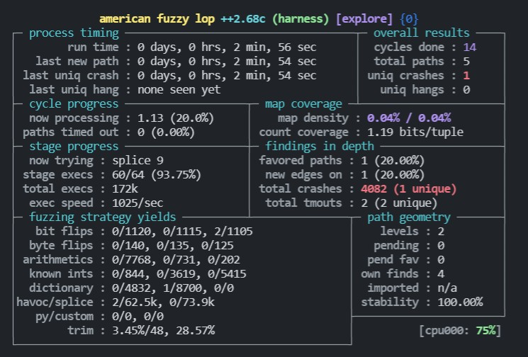
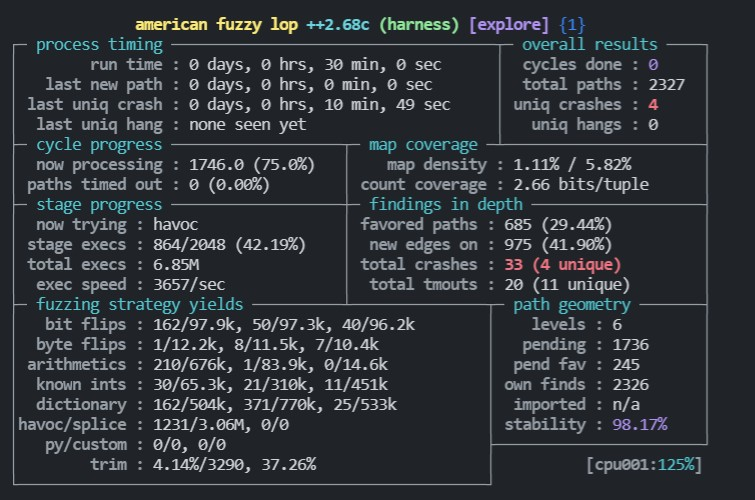

前一篇文章学习了如何编写 Harness，这一篇文章尝试使用 AFL 对 libxml2 进行模糊测试。（尝试利用模糊测试得出 1 day）

---

# Harness编写

这里复习一下前面所学的 Harness，编写 Harness 可以按照以下的步骤来编写。
1. 写出依赖库的简单用法。
2. 控制一些无关变量，并在上一步的基础上增加输入。
3. 合理利用 Fuzzer 工具的特性，提升 Fuzz 速度。

## 简单使用

首先安装 afl-training 所说的，先编译 libxml2 库，然后再使用。
```bash
# 下载子模块
git submodule init && git submodule update
cd libxml2
# 指定编译器，并生成makefile
CC=afl-clang-fast ./autogen.sh
# 使用ASAN模式来编译
AFL_USE_ASAN=1 make -j 4

# 为了方便编写代码，我把依赖库安装到本地了。
# 安装 libxml2
sudo make install
# 卸载 libxml2
```
再到网上找一些简单的使用案例：
**1、创建 xml**
```c
// example1.c
#include<stdio.h>
#include<libxml/parser.h>
#include<libxml/tree.h>


int main(int argc, char **argv){
    // 因为总是要在 xmlChar* 和char*之间进行类型转换，所以定义了一个宏 BAD_CAST
    // #define BAD_CAST (xmlChar *)
    xmlDocPtr doc = xmlNewDoc(BAD_CAST"1.0");
    xmlNodePtr rootNode = xmlNewNode(NULL, BAD_CAST"root");
    printf("success\n");
    xmlFreeDoc(doc);
    return 0;
}
```
编译运行
 
```bash
afl-clang-fast example1.c -I libxml2/include/ -lxml2 -o example1
./example1
# 输出 success
```
**2、解析 xml**
```c
// example2.c
#include<stdio.h>
#include<libxml/parser.h>
#include<libxml/tree.h>

// question：为什么Harness只是对文件进行初始化后就释放了？（answer：这个位置可探索的路径多，如果写得比较多就很难判断漏洞的位置）
// 攻击面？我尝试了以下创建文件，也找到了crash但不会判断是否存在漏洞。
int main(int argc, char **argv){
    xmlDocPtr doc = xmlReadFile("test.xml", NULL, 0);
    if(doc != NULL){
        xmlFreeDoc(doc);
    }
}
// 创建 test.xml 并在里面写入一个简单的xml。
```
编译运行
 
```bash
afl-clang-fast example2.c -I libxml2/include/ -lxml2 -o example1
./example2
# 输出 success
```

# harness

**harness-v1.c**

在使用的基础上，增加输入功能就可以得到 Harness 了。
```c
// harness-v1.c
#include<stdio.h>
#include<libxml/parser.h>
#include<libxml/tree.h>
#include<unistd.h>

#define SIZE 50

int main(int argc, char **argv){
    // 因为总是要在 xmlChar* 和char*之间进行类型转换，所以定义了一个宏 BAD_CAST
    // #define BAD_CAST (xmlChar *)
    
    char input[SIZE] = {0};
    read(STDIN_FILENO, input, SIZE);

    xmlDocPtr doc = xmlNewDoc(BAD_CAST"1.0");
    xmlNodePtr rootNode = xmlNewNode(NULL, BAD_CAST input);
    xmlFreeDoc(doc);
    
    return 0;
}
```
编译，Fuzz
```bash
# TODO
# 我最开始使用的这种命令来编译运行，结果发现一直无法找到新路径（last new path : none yet (odd, check syntax!)），不清楚具体原因
AFL_USE_ASAN=1 afl-clang-fast ./harness-v1.c -I /usr/local/include/libxml2 -lxml2 -o harness
# 参考 answer 的编译命令
AFL_USE_ASAN=1 afl-clang-fast ./harness-v1.c -I libxml2/include libxml2/.libs/libxml2.a -lz -lm -o harness
# fuzz（标准输入获取数据）
mkdir in
cd in && echo "<hi><hi/>" > hi.xml && cd ..
afl-fuzz -m none -i in/ -o out -x ~/Documents/AFLplusplus/dictionaries/xml.dict ./harness
# -x：指定字典。afl-fuzz对紧凑类型的数据格式做了优化（images、多媒体、压缩格式），不太适合比较冗余的数据格式。
# TODO：一直处在崩溃的状态，不懂得如何处理
```
运行结果



只跑了 2 分钟就跑出了 crash，后续一直处在产生同样的 crash。

**harness-v2.c**

同理，可以将 example2.c 改写成 harness-v2.c
```c
// harness-v2.c
#include<stdio.h>
#include<libxml/parser.h>
#include<libxml/tree.h>
#include<unistd.h>

int main(int argc, char **argv){
    // 因为总是要在 xmlChar* 和char*之间进行类型转换，所以定义了一个宏 BAD_CAST
    // #define BAD_CAST (xmlChar *)

    xmlDocPtr doc = xmlReadFile(argv[1], NULL, 0);
    if(doc != NULL){
        xmlFreeDoc(doc);
    }
    
    return 0;
}
```
编译，并尝试fuzz
```bash
AFL_USE_ASAN=1 afl-clang-fast ./harness-v2.c -I libxml2/include libxml2/.libs/libxml2.a -lz -lm -o harness

# 注意！！文件输入和标准输入不同，文件输入需要使用 @@ 来代替文件名
afl-fuzz -m none -i in/ -o out -x ~/Documents/AFLplusplus/dictionaries/xml.dict ./harness @@ 
```

# 改进Harness

在 afl-training 的 answer 中，作者根据 AFL 的功能特性，改写了 harness，让他的效率可以翻 n 倍（我的测试后发现，速度为原来的 4 倍）。
```c
// harness-v2.c
#include "libxml/parser.h"
#include "libxml/tree.h"

int main(int argc, char **argv) {
    if (argc != 2){
        return(1);
    }

    xmlInitParser();
    while (__AFL_LOOP(1000)) {
        xmlDocPtr doc = xmlReadFile(argv[1], NULL, 0);
        if (doc != NULL) {
            xmlFreeDoc(doc);
        }
    }
    xmlCleanupParser();

    return(0);
}
```
编译，并尝试fuzz
```bash
AFL_USE_ASAN=1 afl-clang-fast ./harness-v3.c -I libxml2/include libxml2/.libs/libxml2.a -lz -lm -o harness

afl-fuzz -m none -i in/ -o out -x ~/Documents/AFLplusplus/dictionaries/xml.dict ./harness @@ 
```
运行结果如下所示



只用了 30 分钟，就跑出了 2300 的路径，4 个 crash。

# 语料库

在上面的例子中，我并没有对输入数据进行调整，都是参考的 answer 中给出的种子，还有就是利用 afl 自带的 dictionary。

目前可以不用很在意这一部分，AFL是一款基于变异的模糊测试工具，只要输入能被正常的读取并处理，一切都好说（只要足够欧x）。

目前先主要把精力集中在编写出能让 AFL 稳定且快速运行的 harness。

# crash

harness-v1.c 是创建 xml，而 v2 和 v3 是解析 xml，后两个的 crash 都可以通过。

**harness-v1.c**
```
joe@joe-virtual-machine:~/Documents/afl-training/challenges/libxml2$ echo crashes/harness-v1/id\:000000\,sig\:06\,src\:000000\,time\:2340\,op\:havoc\,rep\:16 | ./harness-v1
=================================================================
==2024416==ERROR: AddressSanitizer: stack-buffer-overflow on address 0x7ffeef3cbf72 at pc 0x000000533fd8 bp 0x7ffeef3cbed0 sp 0x7ffeef3cbec8
READ of size 1 at 0x7ffeef3cbf72 thread T0
    #0 0x533fd7 in xmlStrdup /home/joe/Documents/afl-training/challenges/libxml2/libxml2/xmlstring.c:70:12
    #1 0x4d2941 in xmlNewNode /home/joe/Documents/afl-training/challenges/libxml2/libxml2/tree.c:2236:17
    #2 0x4c63dc in main /home/joe/Documents/afl-training/challenges/libxml2/harness-v1.c:16:27
    #3 0x7ff4f12940b2 in __libc_start_main /build/glibc-sMfBJT/glibc-2.31/csu/../csu/libc-start.c:308:16
    #4 0x41c61d in _start (/home/joe/Documents/afl-training/challenges/libxml2/harness-v1+0x41c61d)

Address 0x7ffeef3cbf72 is located in stack of thread T0 at offset 82 in frame
    #0 0x4c62ff in main /home/joe/Documents/afl-training/challenges/libxml2/harness-v1.c:8

  This frame has 1 object(s):
    [32, 82) 'input' (line 12) <== Memory access at offset 82 overflows this variable
HINT: this may be a false positive if your program uses some custom stack unwind mechanism, swapcontext or vfork
      (longjmp and C++ exceptions *are* supported)
SUMMARY: AddressSanitizer: stack-buffer-overflow /home/joe/Documents/afl-training/challenges/libxml2/libxml2/xmlstring.c:70:12 in xmlStrdup
Shadow bytes around the buggy address:
  0x10005de71790: 00 00 00 00 00 00 00 00 00 00 00 00 00 00 00 00
  0x10005de717a0: 00 00 00 00 00 00 00 00 00 00 00 00 00 00 00 00
  0x10005de717b0: 00 00 00 00 00 00 00 00 00 00 00 00 00 00 00 00
  0x10005de717c0: 00 00 00 00 00 00 00 00 00 00 00 00 00 00 00 00
  0x10005de717d0: 00 00 00 00 00 00 00 00 00 00 00 00 00 00 00 00
=>0x10005de717e0: 00 00 00 00 f1 f1 f1 f1 00 00 00 00 00 00[02]f3
  0x10005de717f0: f3 f3 f3 f3 00 00 00 00 00 00 00 00 00 00 00 00
  0x10005de71800: 00 00 00 00 00 00 00 00 00 00 00 00 00 00 00 00
  0x10005de71810: 00 00 00 00 00 00 00 00 00 00 00 00 00 00 00 00
  0x10005de71820: 00 00 00 00 00 00 00 00 00 00 00 00 00 00 00 00
  0x10005de71830: 00 00 00 00 00 00 00 00 00 00 00 00 00 00 00 00
Shadow byte legend (one shadow byte represents 8 application bytes):
  Addressable:           00
  Partially addressable: 01 02 03 04 05 06 07 
  Heap left redzone:       fa
  Freed heap region:       fd
  Stack left redzone:      f1
  Stack mid redzone:       f2
  Stack right redzone:     f3
  Stack after return:      f5
  Stack use after scope:   f8
  Global redzone:          f9
  Global init order:       f6
  Poisoned by user:        f7
  Container overflow:      fc
  Array cookie:            ac
  Intra object redzone:    bb
  ASan internal:           fe
  Left alloca redzone:     ca
  Right alloca redzone:    cb
  Shadow gap:              cc
==2024416==ABORTING
```

**harness-v2&v3.c**

崩溃 1
```
joe@joe-virtual-machine:~/Documents/afl-training/challenges/libxml2$ ./harness-v2 crashes/harness-v2\&v3/id\:000000\,sig\:06\,src\:001114\,time\:854359\,op\:flip4\,pos\:17 
crashes/harness-v2&v3/id:000000,sig:06,src:001114,time:854359,op:flip4,pos:17:1: parser error : Malformed declaration expecting version
<?xml encoding="US�-8   �
      ^
crashes/harness-v2&v3/id:000000,sig:06,src:001114,time:854359,op:flip4,pos:17:1: parser error : Blank needed here
<?xml encoding="US�-8   �
      ^
crashes/harness-v2&v3/id:000000,sig:06,src:001114,time:854359,op:flip4,pos:17:1: parser error : String not closed expecting " or '
<?xml encoding="US�-8   �
                  ^
encoding error : input conversion failed due to input error, bytes 0xC6 0x2D 0x38 0x09
crashes/harness-v2&v3/id:000000,sig:06,src:001114,time:854359,op:flip4,pos:17:1: parser error : switching encoding: encoder error
""
   ^
crashes/harness-v2&v3/id:000000,sig:06,src:001114,time:854359,op:flip4,pos:17:1: parser error : Blank needed here
""
   ^
encoding error : input conversion failed due to input error, bytes 0xC6 0x2D 0x38 0x09
I/O error : encoder error
crashes/harness-v2&v3/id:000000,sig:06,src:001114,time:854359,op:flip4,pos:17:1: parser error : parsing XML declaration: '?>' expected

^
=================================================================
==2096894==ERROR: AddressSanitizer: heap-buffer-overflow on address 0x621000002500 at pc 0x0000005147cd bp 0x7ffc65df5860 sp 0x7ffc65df5858
READ of size 1 at 0x621000002500 thread T0
    #0 0x5147cc in xmlParseXMLDecl /home/joe/Documents/afl-training/challenges/libxml2/libxml2/parser.c:10666:2
    #1 0x515e9f in xmlParseDocument /home/joe/Documents/afl-training/challenges/libxml2/libxml2/parser.c:10771:2
    #2 0x5316ab in xmlDoRead /home/joe/Documents/afl-training/challenges/libxml2/libxml2/parser.c:15298:5
    #3 0x5316ab in xmlReadFile /home/joe/Documents/afl-training/challenges/libxml2/libxml2/parser.c:15360:13
    #4 0x4c62ed in main /home/joe/Documents/afl-training/challenges/libxml2/harness-v2.c:11:21
    #5 0x7ff525b080b2 in __libc_start_main /build/glibc-sMfBJT/glibc-2.31/csu/../csu/libc-start.c:308:16
    #6 0x41c61d in _start (/home/joe/Documents/afl-training/challenges/libxml2/harness-v2+0x41c61d)

0x621000002500 is located 0 bytes to the right of 4096-byte region [0x621000001500,0x621000002500)
allocated by thread T0 here:
    #0 0x49668d in malloc (/home/joe/Documents/afl-training/challenges/libxml2/harness-v2+0x49668d)
    #1 0x684bae in xmlBufCreate /home/joe/Documents/afl-training/challenges/libxml2/libxml2/buf.c:136:32

SUMMARY: AddressSanitizer: heap-buffer-overflow /home/joe/Documents/afl-training/challenges/libxml2/libxml2/parser.c:10666:2 in xmlParseXMLDecl
Shadow bytes around the buggy address:
  0x0c427fff8450: 00 00 00 00 00 00 00 00 00 00 00 00 00 00 00 00
  0x0c427fff8460: 00 00 00 00 00 00 00 00 00 00 00 00 00 00 00 00
  0x0c427fff8470: 00 00 00 00 00 00 00 00 00 00 00 00 00 00 00 00
  0x0c427fff8480: 00 00 00 00 00 00 00 00 00 00 00 00 00 00 00 00
  0x0c427fff8490: 00 00 00 00 00 00 00 00 00 00 00 00 00 00 00 00
=>0x0c427fff84a0:[fa]fa fa fa fa fa fa fa fa fa fa fa fa fa fa fa
  0x0c427fff84b0: fa fa fa fa fa fa fa fa fa fa fa fa fa fa fa fa
  0x0c427fff84c0: fa fa fa fa fa fa fa fa fa fa fa fa fa fa fa fa
  0x0c427fff84d0: fa fa fa fa fa fa fa fa fa fa fa fa fa fa fa fa
  0x0c427fff84e0: fa fa fa fa fa fa fa fa fa fa fa fa fa fa fa fa
  0x0c427fff84f0: fa fa fa fa fa fa fa fa fa fa fa fa fa fa fa fa
Shadow byte legend (one shadow byte represents 8 application bytes):
  Addressable:           00
  Partially addressable: 01 02 03 04 05 06 07 
  Heap left redzone:       fa
  Freed heap region:       fd
  Stack left redzone:      f1
  Stack mid redzone:       f2
  Stack right redzone:     f3
  Stack after return:      f5
  Stack use after scope:   f8
  Global redzone:          f9
  Global init order:       f6
  Poisoned by user:        f7
  Container overflow:      fc
  Array cookie:            ac
  Intra object redzone:    bb
  ASan internal:           fe
  Left alloca redzone:     ca
  Right alloca redzone:    cb
  Shadow gap:              cc
==2096894==ABORTING
```
崩溃 2
```
joe@joe-virtual-machine:~/Documents/afl-training/challenges/libxml2$ ./harness-v2 crashes/harness-v2\&v3/id\:000001\,sig\:06\,src\:001114\,time\:854371\,op\:flip4\,pos\:20 
crashes/harness-v2&v3/id:000001,sig:06,src:001114,time:854371,op:flip4,pos:20:1: parser error : Malformed declaration expecting version
<?xml encoding="UTF-7   �
      ^
crashes/harness-v2&v3/id:000001,sig:06,src:001114,time:854371,op:flip4,pos:20:1: parser error : Blank needed here
<?xml encoding="UTF-7   �
      ^
crashes/harness-v2&v3/id:000001,sig:06,src:001114,time:854371,op:flip4,pos:20:1: parser error : String not closed expecting " or '
<?xml encoding="UTF-7   �
                     ^
encoding error : input conversion failed due to input error, bytes 0xAB 0x0D 0x22 0x1F
crashes/harness-v2&v3/id:000001,sig:06,src:001114,time:854371,op:flip4,pos:20:1: parser error : switching encoding: encoder error
""
   ^
encoding error : input conversion failed due to input error, bytes 0xAB 0x0D 0x22 0x1F
I/O error : encoder error
crashes/harness-v2&v3/id:000001,sig:06,src:001114,time:854371,op:flip4,pos:20:1: parser error : parsing XML declaration: '?>' expected

        ^
=================================================================
==2153390==ERROR: AddressSanitizer: heap-buffer-overflow on address 0x621000002500 at pc 0x0000005147cd bp 0x7ffda09219e0 sp 0x7ffda09219d8
READ of size 1 at 0x621000002500 thread T0
    #0 0x5147cc in xmlParseXMLDecl /home/joe/Documents/afl-training/challenges/libxml2/libxml2/parser.c:10666:2
    #1 0x515e9f in xmlParseDocument /home/joe/Documents/afl-training/challenges/libxml2/libxml2/parser.c:10771:2
    #2 0x5316ab in xmlDoRead /home/joe/Documents/afl-training/challenges/libxml2/libxml2/parser.c:15298:5
    #3 0x5316ab in xmlReadFile /home/joe/Documents/afl-training/challenges/libxml2/libxml2/parser.c:15360:13
    #4 0x4c62ed in main /home/joe/Documents/afl-training/challenges/libxml2/harness-v2.c:11:21
    #5 0x7f25059470b2 in __libc_start_main /build/glibc-sMfBJT/glibc-2.31/csu/../csu/libc-start.c:308:16
    #6 0x41c61d in _start (/home/joe/Documents/afl-training/challenges/libxml2/harness-v2+0x41c61d)

0x621000002500 is located 0 bytes to the right of 4096-byte region [0x621000001500,0x621000002500)
allocated by thread T0 here:
    #0 0x49668d in malloc (/home/joe/Documents/afl-training/challenges/libxml2/harness-v2+0x49668d)
    #1 0x684bae in xmlBufCreate /home/joe/Documents/afl-training/challenges/libxml2/libxml2/buf.c:136:32

SUMMARY: AddressSanitizer: heap-buffer-overflow /home/joe/Documents/afl-training/challenges/libxml2/libxml2/parser.c:10666:2 in xmlParseXMLDecl
Shadow bytes around the buggy address:
  0x0c427fff8450: 00 00 00 00 00 00 00 00 00 00 00 00 00 00 00 00
  0x0c427fff8460: 00 00 00 00 00 00 00 00 00 00 00 00 00 00 00 00
  0x0c427fff8470: 00 00 00 00 00 00 00 00 00 00 00 00 00 00 00 00
  0x0c427fff8480: 00 00 00 00 00 00 00 00 00 00 00 00 00 00 00 00
  0x0c427fff8490: 00 00 00 00 00 00 00 00 00 00 00 00 00 00 00 00
=>0x0c427fff84a0:[fa]fa fa fa fa fa fa fa fa fa fa fa fa fa fa fa
  0x0c427fff84b0: fa fa fa fa fa fa fa fa fa fa fa fa fa fa fa fa
  0x0c427fff84c0: fa fa fa fa fa fa fa fa fa fa fa fa fa fa fa fa
  0x0c427fff84d0: fa fa fa fa fa fa fa fa fa fa fa fa fa fa fa fa
  0x0c427fff84e0: fa fa fa fa fa fa fa fa fa fa fa fa fa fa fa fa
  0x0c427fff84f0: fa fa fa fa fa fa fa fa fa fa fa fa fa fa fa fa
Shadow byte legend (one shadow byte represents 8 application bytes):
  Addressable:           00
  Partially addressable: 01 02 03 04 05 06 07 
  Heap left redzone:       fa
  Freed heap region:       fd
  Stack left redzone:      f1
  Stack mid redzone:       f2
  Stack right redzone:     f3
  Stack after return:      f5
  Stack use after scope:   f8
  Global redzone:          f9
  Global init order:       f6
  Poisoned by user:        f7
  Container overflow:      fc
  Array cookie:            ac
  Intra object redzone:    bb
  ASan internal:           fe
  Left alloca redzone:     ca
  Right alloca redzone:    cb
  Shadow gap:              cc
==2153390==ABORTING
```
崩溃 3
```
~/Documents/afl-training/challenges/libxml2$ ./harness-v2 crashes/harness-v2\&v3/id\:000002\,sig\:06\,src\:001114\,time\:854809\,op\:arith16\,pos\:20\,val\:be\:-11 
crashes/harness-v2&v3/id:000002,sig:06,src:001114,time:854809,op:arith16,pos:20,val:be:-11:1: parser error : Malformed declaration expecting version
<?xml encoding="UTF-7��
      ^
crashes/harness-v2&v3/id:000002,sig:06,src:001114,time:854809,op:arith16,pos:20,val:be:-11:1: parser error : Blank needed here
<?xml encoding="UTF-7��
      ^
crashes/harness-v2&v3/id:000002,sig:06,src:001114,time:854809,op:arith16,pos:20,val:be:-11:1: parser error : String not closed expecting " or '
<?xml encoding="UTF-7��
                     ^
encoding error : input conversion failed due to input error, bytes 0xFE 0xAB 0x0D 0x22
crashes/harness-v2&v3/id:000002,sig:06,src:001114,time:854809,op:arith16,pos:20,val:be:-11:1: parser error : switching encoding: encoder error
""
   ^
crashes/harness-v2&v3/id:000002,sig:06,src:001114,time:854809,op:arith16,pos:20,val:be:-11:1: parser error : Blank needed here
""
   ^
encoding error : input conversion failed due to input error, bytes 0xFE 0xAB 0x0D 0x22
I/O error : encoder error
crashes/harness-v2&v3/id:000002,sig:06,src:001114,time:854809,op:arith16,pos:20,val:be:-11:1: parser error : parsing XML declaration: '?>' expected

^
=================================================================
==2177406==ERROR: AddressSanitizer: heap-buffer-overflow on address 0x621000002500 at pc 0x0000005147cd bp 0x7fff7d348ae0 sp 0x7fff7d348ad8
READ of size 1 at 0x621000002500 thread T0
    #0 0x5147cc in xmlParseXMLDecl /home/joe/Documents/afl-training/challenges/libxml2/libxml2/parser.c:10666:2
    #1 0x515e9f in xmlParseDocument /home/joe/Documents/afl-training/challenges/libxml2/libxml2/parser.c:10771:2
    #2 0x5316ab in xmlDoRead /home/joe/Documents/afl-training/challenges/libxml2/libxml2/parser.c:15298:5
    #3 0x5316ab in xmlReadFile /home/joe/Documents/afl-training/challenges/libxml2/libxml2/parser.c:15360:13
    #4 0x4c62ed in main /home/joe/Documents/afl-training/challenges/libxml2/harness-v2.c:11:21
    #5 0x7f8c4243f0b2 in __libc_start_main /build/glibc-sMfBJT/glibc-2.31/csu/../csu/libc-start.c:308:16
    #6 0x41c61d in _start (/home/joe/Documents/afl-training/challenges/libxml2/harness-v2+0x41c61d)

0x621000002500 is located 0 bytes to the right of 4096-byte region [0x621000001500,0x621000002500)
allocated by thread T0 here:
    #0 0x49668d in malloc (/home/joe/Documents/afl-training/challenges/libxml2/harness-v2+0x49668d)
    #1 0x684bae in xmlBufCreate /home/joe/Documents/afl-training/challenges/libxml2/libxml2/buf.c:136:32

SUMMARY: AddressSanitizer: heap-buffer-overflow /home/joe/Documents/afl-training/challenges/libxml2/libxml2/parser.c:10666:2 in xmlParseXMLDecl
Shadow bytes around the buggy address:
  0x0c427fff8450: 00 00 00 00 00 00 00 00 00 00 00 00 00 00 00 00
  0x0c427fff8460: 00 00 00 00 00 00 00 00 00 00 00 00 00 00 00 00
  0x0c427fff8470: 00 00 00 00 00 00 00 00 00 00 00 00 00 00 00 00
  0x0c427fff8480: 00 00 00 00 00 00 00 00 00 00 00 00 00 00 00 00
  0x0c427fff8490: 00 00 00 00 00 00 00 00 00 00 00 00 00 00 00 00
=>0x0c427fff84a0:[fa]fa fa fa fa fa fa fa fa fa fa fa fa fa fa fa
  0x0c427fff84b0: fa fa fa fa fa fa fa fa fa fa fa fa fa fa fa fa
  0x0c427fff84c0: fa fa fa fa fa fa fa fa fa fa fa fa fa fa fa fa
  0x0c427fff84d0: fa fa fa fa fa fa fa fa fa fa fa fa fa fa fa fa
  0x0c427fff84e0: fa fa fa fa fa fa fa fa fa fa fa fa fa fa fa fa
  0x0c427fff84f0: fa fa fa fa fa fa fa fa fa fa fa fa fa fa fa fa
Shadow byte legend (one shadow byte represents 8 application bytes):
  Addressable:           00
  Partially addressable: 01 02 03 04 05 06 07 
  Heap left redzone:       fa
  Freed heap region:       fd
  Stack left redzone:      f1
  Stack mid redzone:       f2
  Stack right redzone:     f3
  Stack after return:      f5
  Stack use after scope:   f8
  Global redzone:          f9
  Global init order:       f6
  Poisoned by user:        f7
  Container overflow:      fc
  Array cookie:            ac
  Intra object redzone:    bb
  ASan internal:           fe
  Left alloca redzone:     ca
  Right alloca redzone:    cb
  Shadow gap:              cc
==2177406==ABORTING
```
崩溃 4
```
joe@joe-virtual-machine:~/Documents/afl-training/challenges/libxml2$ ./harness-v2 crashes/harness-v2\&v3/id\:000003\,sig\:06\,src\:001314\,time\:1151138\,op\:havoc\,rep\:2 
crashes/harness-v2&v3/id:000003,sig:06,src:001314,time:1151138,op:havoc,rep:2:1: parser error : Malformed declaration expecting version
<?xml encoding="UCS-4��-a>NMTOKE<N8-a> 
      ^
crashes/harness-v2&v3/id:000003,sig:06,src:001314,time:1151138,op:havoc,rep:2:1: parser error : Blank needed here
<?xml encoding="UCS-4��-a>NMTOKE<N8-a> 
      ^
crashes/harness-v2&v3/id:000003,sig:06,src:001314,time:1151138,op:havoc,rep:2:1: parser error : String not closed expecting " or '
<?xml encoding="UCS-4��-a>NMTOKE<N8-a> 
                     ^
encoding error : input conversion failed due to input error, bytes 0xE6 0xDA 0x2D 0x61
crashes/harness-v2&v3/id:000003,sig:06,src:001314,time:1151138,op:havoc,rep:2:1: parser error : switching encoding: encoder error
��-a>NMTOKE<N8-a> 
                   ^
crashes/harness-v2&v3/id:000003,sig:06,src:001314,time:1151138,op:havoc,rep:2:1: parser error : Blank needed here
��-a>NMTOKE<N8-a> 
                   ^
encoding error : input conversion failed due to input error, bytes 0xE6 0xDA 0x2D 0x61
I/O error : encoder error
crashes/harness-v2&v3/id:000003,sig:06,src:001314,time:1151138,op:havoc,rep:2:1: parser error : parsing XML declaration: '?>' expected

^
=================================================================
==2191499==ERROR: AddressSanitizer: heap-buffer-overflow on address 0x621000002500 at pc 0x0000005147cd bp 0x7ffe84bf5b60 sp 0x7ffe84bf5b58
READ of size 1 at 0x621000002500 thread T0
    #0 0x5147cc in xmlParseXMLDecl /home/joe/Documents/afl-training/challenges/libxml2/libxml2/parser.c:10666:2
    #1 0x515e9f in xmlParseDocument /home/joe/Documents/afl-training/challenges/libxml2/libxml2/parser.c:10771:2
    #2 0x5316ab in xmlDoRead /home/joe/Documents/afl-training/challenges/libxml2/libxml2/parser.c:15298:5
    #3 0x5316ab in xmlReadFile /home/joe/Documents/afl-training/challenges/libxml2/libxml2/parser.c:15360:13
    #4 0x4c62ed in main /home/joe/Documents/afl-training/challenges/libxml2/harness-v2.c:11:21
    #5 0x7f35503610b2 in __libc_start_main /build/glibc-sMfBJT/glibc-2.31/csu/../csu/libc-start.c:308:16
    #6 0x41c61d in _start (/home/joe/Documents/afl-training/challenges/libxml2/harness-v2+0x41c61d)

0x621000002500 is located 0 bytes to the right of 4096-byte region [0x621000001500,0x621000002500)
allocated by thread T0 here:
    #0 0x49668d in malloc (/home/joe/Documents/afl-training/challenges/libxml2/harness-v2+0x49668d)
    #1 0x684bae in xmlBufCreate /home/joe/Documents/afl-training/challenges/libxml2/libxml2/buf.c:136:32

SUMMARY: AddressSanitizer: heap-buffer-overflow /home/joe/Documents/afl-training/challenges/libxml2/libxml2/parser.c:10666:2 in xmlParseXMLDecl
Shadow bytes around the buggy address:
  0x0c427fff8450: 00 00 00 00 00 00 00 00 00 00 00 00 00 00 00 00
  0x0c427fff8460: 00 00 00 00 00 00 00 00 00 00 00 00 00 00 00 00
  0x0c427fff8470: 00 00 00 00 00 00 00 00 00 00 00 00 00 00 00 00
  0x0c427fff8480: 00 00 00 00 00 00 00 00 00 00 00 00 00 00 00 00
  0x0c427fff8490: 00 00 00 00 00 00 00 00 00 00 00 00 00 00 00 00
=>0x0c427fff84a0:[fa]fa fa fa fa fa fa fa fa fa fa fa fa fa fa fa
  0x0c427fff84b0: fa fa fa fa fa fa fa fa fa fa fa fa fa fa fa fa
  0x0c427fff84c0: fa fa fa fa fa fa fa fa fa fa fa fa fa fa fa fa
  0x0c427fff84d0: fa fa fa fa fa fa fa fa fa fa fa fa fa fa fa fa
  0x0c427fff84e0: fa fa fa fa fa fa fa fa fa fa fa fa fa fa fa fa
  0x0c427fff84f0: fa fa fa fa fa fa fa fa fa fa fa fa fa fa fa fa
Shadow byte legend (one shadow byte represents 8 application bytes):
  Addressable:           00
  Partially addressable: 01 02 03 04 05 06 07 
  Heap left redzone:       fa
  Freed heap region:       fd
  Stack left redzone:      f1
  Stack mid redzone:       f2
  Stack right redzone:     f3
  Stack after return:      f5
  Stack use after scope:   f8
  Global redzone:          f9
  Global init order:       f6
  Poisoned by user:        f7
  Container overflow:      fc
  Array cookie:            ac
  Intra object redzone:    bb
  ASan internal:           fe
  Left alloca redzone:     ca
  Right alloca redzone:    cb
  Shadow gap:              cc
==2191499==ABORTING
```

根据 crash 搜索相关的 CVE


很遗憾，前面的 crash 没有找到 CVE，我也无法判断这是不是一个 CVE。待续……
TODO

# 总结

Harness 的编写，字典的收集都还是一个难点。后续的例子尽可能往这两个方向去学习吧。


参考文档：
- [c++ libxml2 简明入门使用教程](https://blog.csdn.net/joelcat/article/details/78643799)
- [libxml2生成，解析，修改xml文件，以及使用实例](https://blog.csdn.net/hpu11/article/details/80793303)