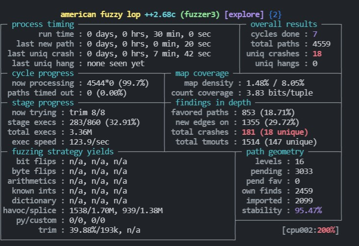
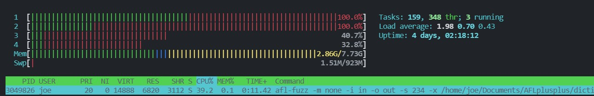
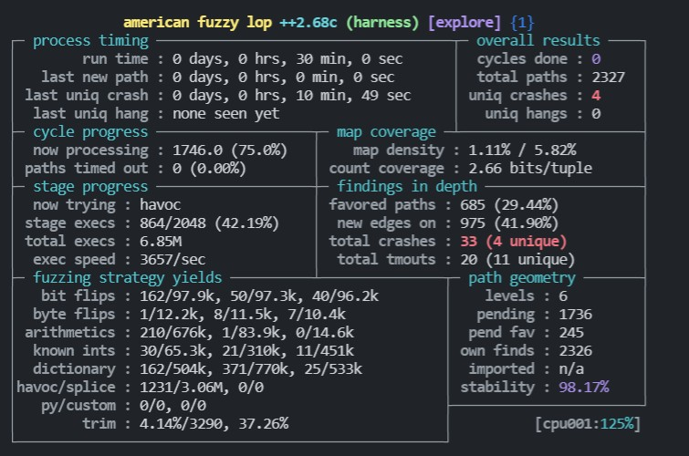
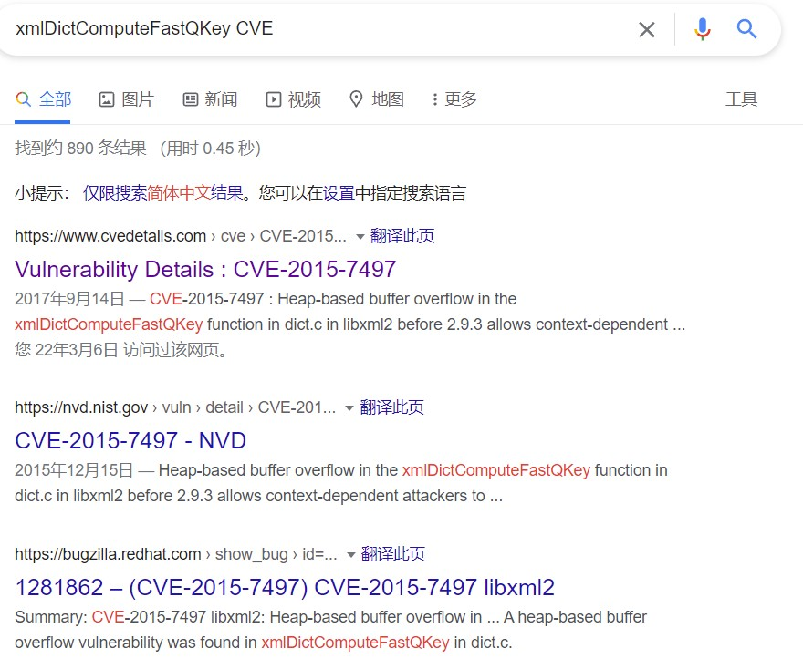

相信不止我一个人对 libxml2 进行模糊测试，看看别人是怎么做的，然后学其所长，提高我对 Fuzzing 的理解。

遵循 i+1 式的学习，而不是一次迈一大步。

---

这篇文章的主题是——多核并行 Fuzzing，主要参考了 Fuzzing010 的练习5.

# 多核并行模糊测试

Fuzzing010 使用的 libxml2 是 2.9.4，但我在上一篇文章使用的案例是 2.9.2，所以没有找到 xmllint 程序。

在做完了 Fuzzing010 的实验之后，我又回来使用上一篇文章中的 Harness 进行模糊测试。

大体思路是一致的：
- 准备调用lib库的程序。
- 准备字典
- 模糊测试

多核并行模糊测试主要是压榨自己电脑的性能来跑 Fuzzing。如果没有配置多核并行直接跑多个模糊测试，各个Fuzzing进程可能会有重复的路径，自己无法区分，导致很难对 Fuzzing 的程度进行判断。

在上一篇文章中，运行模糊测试的命令如下所示

```bash 
afl-fuzz -m none -i in -o out -x ~/Documents/AFLplusplus/dictionaries/xml.dict -- ./harness-v3 @@
```
只需要将命令改成下面这种形式即可
```bash
# 主 Fuzzing 程序
afl-fuzz -m none -i in -o out -s 123 -x ~/Documents/AFLplusplus/dictionaries/xml.dict -D -M fuzzer1 -- ./harness-v3 @@
# 从 Fuzzing 程序
afl-fuzz -m none -i in -o out -s 233 -x ~/Documents/AFLplusplus/dictionaries/xml.dict -S fuzzer2 -- ./harness-v3 @@
afl-fuzz -m none -i in -o out -s 345 -x ~/Documents/AFLplusplus/dictionaries/xml.dict -S fuzzer3 -- ./harness-v3 @@
```
在命令中多加了 3 个参数：
- -s：设置种子，让不同的 Fuzzing 进程尽量使用不同的输入
- -M/-S：设置主从 Fuzzing 程序的名字。
- -D：只能主 Fuzzing 程序，强制执行确定性模糊测试。

其他参数含义：
- --：后面跟执行 Harness 的命令。
- @@：afl-fuzz 会将文件名放到 @@ 所在的位置。

命令执行成功后的效果如下所示



使用 htop 查看 CPU 情况



使用了两个 Fuzzing 程序，占用两颗 CPU。

# 效果对比

在上一篇文章中，我使用 harness-v3.c 跑了半小时找到 2000+ 路径，通过 Crash 信息只找到一个 CVE。



同样使用 harness-v3.c 跑了半小时找到了 4000+ 路径，并且通过 Crash 信息找到两个 CVE。


> PS：如果没耐心，就尽可能想办法提高 Fuzzing 效率叭。

# crash

在 Fuzzing 程序结束后，我利用 ASAN 的信息 来对崩溃进行分析，又找到了另外一个 1 day。造成 crash 的输入已经放到 codes 文件夹中。

```bash
joe@joe-virtual-machine:~/Documents/afl-training/challenges/libxml2$ ./harness-v2 out/fuzzer3/crashes/id\:000017\,sig\:06\,src\:003301\,time\:1337746\,op\:havoc\,rep\:8 
out/fuzzer3/crashes/id:000017,sig:06,src:003301,time:1337746,op:havoc,rep:8:1: namespace error : Namespace prefix iiiiiiiiiiiiiiiiiiiiiiiiiiiiiiiiiiiiiiiiiiiiiiiiiiiiiiiiiiiiiiiiiiiiiiiiiiiiiiiiiiiiiiiiiiiiiiiiiiiiiiiiiiiiiiiiiiiiiiiiiiiiiiiiiiiiiiiiiiiiiiiiiiiiiiiiiiiiiiiiiiiiiiiiiiiiiiiiiiiiiiiiiiiiiiiiiiiiiiiiiiiiiiiiiiiiiiiiiiiiiiiiiiiiiiiiiiiiiiiiiiiiiiiiiiiiiiiiiiiiiiiiiiiiiiiiiiiiiiiiiiiiiiiiiiiiiiiiiiiiiiiiiiiiiiiiiiiiiiiiiiiiiiiiiiiiiiiiiiiiiiiiiiiiiiiiiiiiiiiiiiiiiiiiiiiiiiiiiiiiiiiiiiiiiiiiiiiiiitiiiiiiiiiiiiiiiiiiiiiiiiiiiiiiiiiiiiiiiiiiiiiiiiiiiiiiiiiiiiiiiiiiiiiiiiiiiiiiiiiiiiiiiiiiiiiiiiiiiiiiiiiiiiiiiiiiiiiiiiiiiiiiiiiiiiiiiiiiiiiiiiiiiiiiiiiiiiiiiiiiiiiiiiiiiiiiiiiiiiiiiiiiiiiiiiiiiiiiiiiiiiiiiiiiiiiiiiiiiiiiiiiiiiiiiiiiiiiiiiiiiiiiiiiiiiiiiiiiiiiiiiiiiiiiiiiiiiii on includeiiiiiiiiiiiiiiiiiiiiiiiiiiiiiiiiiiiiiiiiiiiiiiiiiiiiiiiiiiiiiiiiiiiiiiiiiiiiiiiiiiiiiiiiiiiiiiiiiiiiiiiiiiiiiiiiiiiiiiiiiiiiiiiiiiiiiiiiiiiiiiiiiiiiiiiiiimiiiiiiiiiiiiiiiiiiiiiiiiiiiiiiiiiiiiiiiiiiiiiiiiiiiiiiiiiiiiiiiiiiiiiiiiiiiiiiiiiiiiiiiiiiiiiiiiiiiiiiiiiiiiiiiiiiiiiiiiiiiiiiiiiiiiiiiiiiiiiiiiiiiiiiiiiiiiiiiiiiiiiiiiiiiii is not defined
iiiiiiiiiiiiiiiiiiiiiiiiiiiiiiiiiiiiiiiiiiiiiiiiiiiiiiiiiiiiiiiiiiiiiiiiiiiiiiii
                                                                               ^
=================================================================
==2943385==ERROR: AddressSanitizer: heap-buffer-overflow on address 0x6210000013d0 at pc 0x000000736b6c bp 0x7ffc7a1a52e0 sp 0x7ffc7a1a52d8
READ of size 1 at 0x6210000013d0 thread T0
    #0 0x736b6b in xmlDictComputeFastQKey /home/joe/Documents/afl-training/challenges/libxml2/libxml2/dict.c:489:18
    #1 0x734d60 in xmlDictQLookup /home/joe/Documents/afl-training/challenges/libxml2/libxml2/dict.c:1093:12
    #2 0x743766 in xmlSAX2StartElementNs /home/joe/Documents/afl-training/challenges/libxml2/libxml2/SAX2.c:2238:17
    #3 0x50f94a in xmlParseStartTag2 /home/joe/Documents/afl-training/challenges/libxml2/libxml2/parser.c
    #4 0x5068b3 in xmlParseElement /home/joe/Documents/afl-training/challenges/libxml2/libxml2/parser.c:10069:16
    #5 0x516538 in xmlParseDocument /home/joe/Documents/afl-training/challenges/libxml2/libxml2/parser.c:10841:2
    #6 0x5316ab in xmlDoRead /home/joe/Documents/afl-training/challenges/libxml2/libxml2/parser.c:15298:5
    #7 0x5316ab in xmlReadFile /home/joe/Documents/afl-training/challenges/libxml2/libxml2/parser.c:15360:13
    #8 0x4c62ed in main /home/joe/Documents/afl-training/challenges/libxml2/harness-v2.c:11:21
    #9 0x7f38283e40b2 in __libc_start_main /build/glibc-sMfBJT/glibc-2.31/csu/../csu/libc-start.c:308:16
    #10 0x41c61d in _start (/home/joe/Documents/afl-training/challenges/libxml2/harness-v2+0x41c61d)

0x6210000013d0 is located 720 bytes to the right of 4096-byte region [0x621000000100,0x621000001100)
allocated by thread T0 here:
    #0 0x49668d in malloc (/home/joe/Documents/afl-training/challenges/libxml2/harness-v2+0x49668d)
    #1 0x730049 in xmlDictCreate /home/joe/Documents/afl-training/challenges/libxml2/libxml2/dict.c:554:22

SUMMARY: AddressSanitizer: heap-buffer-overflow /home/joe/Documents/afl-training/challenges/libxml2/libxml2/dict.c:489:18 in xmlDictComputeFastQKey
Shadow bytes around the buggy address:
  0x0c427fff8220: fa fa fa fa fa fa fa fa fa fa fa fa fa fa fa fa
  0x0c427fff8230: fa fa fa fa fa fa fa fa fa fa fa fa fa fa fa fa
  0x0c427fff8240: fa fa fa fa fa fa fa fa fa fa fa fa fa fa fa fa
  0x0c427fff8250: fa fa fa fa fa fa fa fa fa fa fa fa fa fa fa fa
  0x0c427fff8260: fa fa fa fa fa fa fa fa fa fa fa fa fa fa fa fa
=>0x0c427fff8270: fa fa fa fa fa fa fa fa fa fa[fa]fa fa fa fa fa
  0x0c427fff8280: fa fa fa fa fa fa fa fa fa fa fa fa fa fa fa fa
  0x0c427fff8290: fa fa fa fa fa fa fa fa fa fa fa fa fa fa fa fa
  0x0c427fff82a0: 00 00 00 00 00 00 00 00 00 00 00 00 00 00 00 00
  0x0c427fff82b0: 00 00 00 00 00 00 00 00 00 00 00 00 00 00 00 00
  0x0c427fff82c0: 00 00 00 00 00 00 00 00 00 00 00 00 00 00 00 00
Shadow byte legend (one shadow byte represents 8 application bytes):
  Addressable:           00
  Partially addressable: 01 02 03 04 05 06 07 
  Heap left redzone:       fa
  Freed heap region:       fd
  Stack left redzone:      f1
  Stack mid redzone:       f2
  Stack right redzone:     f3
  Stack after return:      f5
  Stack use after scope:   f8
  Global redzone:          f9
  Global init order:       f6
  Poisoned by user:        f7
  Container overflow:      fc
  Array cookie:            ac
  Intra object redzone:    bb
  ASan internal:           fe
  Left alloca redzone:     ca
  Right alloca redzone:    cb
  Shadow gap:              cc
==2943385==ABORTING
```
根据 crash 的信息，我又找到了另一个 CVE——CVE-2015-7497。



上一次的 CVE 编号是 `CVE-2015-8317`，累计找到两个历史 CVE。

# 又一个历史CVE

我试着延长了一下Fuzzing时间（持久模式+多核并行模式），又找到了另一个 CVE。崩溃信息如下所示

```
joe@joe-virtual-machine:~/Documents/afl-training/challenges/libxml2$ ./harness-v2 ./outCopy/fuzzer2/crashes/id\:000001\,sig\:06\,src\:004494\,time\:3178209\,op\:havoc\,rep\:2 
./outCopy/fuzzer2/crashes/id:000001,sig:06,src:004494,time:3178209,op:havoc,rep:2:6901: namespace warning : xmlns: URI 1 is not absolute
 xmlns="1"
          ^
=================================================================
==3305202==ERROR: AddressSanitizer: heap-use-after-free on address 0x625000001116 at pc 0x0000007466f0 bp 0x7fff3bb5c050 sp 0x7fff3bb5c048
READ of size 1 at 0x625000001116 thread T0
    #0 0x7466ef in xmlSAX2AttributeNs /home/joe/Documents/afl-training/challenges/libxml2/libxml2/SAX2.c:2035:6
    #1 0x7443a0 in xmlSAX2StartElementNs /home/joe/Documents/afl-training/challenges/libxml2/libxml2/SAX2.c
    #2 0x50f94a in xmlParseStartTag2 /home/joe/Documents/afl-training/challenges/libxml2/libxml2/parser.c
    #3 0x5068b3 in xmlParseElement /home/joe/Documents/afl-training/challenges/libxml2/libxml2/parser.c:10069:16
    #4 0x516538 in xmlParseDocument /home/joe/Documents/afl-training/challenges/libxml2/libxml2/parser.c:10841:2
    #5 0x5316ab in xmlDoRead /home/joe/Documents/afl-training/challenges/libxml2/libxml2/parser.c:15298:5
    #6 0x5316ab in xmlReadFile /home/joe/Documents/afl-training/challenges/libxml2/libxml2/parser.c:15360:13
    #7 0x4c62ed in main /home/joe/Documents/afl-training/challenges/libxml2/harness-v2.c:11:21
    #8 0x7f467fc430b2 in __libc_start_main /build/glibc-sMfBJT/glibc-2.31/csu/../csu/libc-start.c:308:16
    #9 0x41c61d in _start (/home/joe/Documents/afl-training/challenges/libxml2/harness-v2+0x41c61d)

0x625000001116 is located 4118 bytes inside of 8194-byte region [0x625000000100,0x625000002102)
freed by thread T0 here:
    #0 0x4969a9 in realloc (/home/joe/Documents/afl-training/challenges/libxml2/harness-v2+0x4969a9)
    #1 0x686799 in xmlBufGrowInternal /home/joe/Documents/afl-training/challenges/libxml2/libxml2/buf.c:472:23

previously allocated by thread T0 here:
    #0 0x49668d in malloc (/home/joe/Documents/afl-training/challenges/libxml2/harness-v2+0x49668d)
    #1 0x684f61 in xmlBufCreateSize /home/joe/Documents/afl-training/challenges/libxml2/libxml2/buf.c:171:36

SUMMARY: AddressSanitizer: heap-use-after-free /home/joe/Documents/afl-training/challenges/libxml2/libxml2/SAX2.c:2035:6 in xmlSAX2AttributeNs
Shadow bytes around the buggy address:
  0x0c4a7fff81d0: fd fd fd fd fd fd fd fd fd fd fd fd fd fd fd fd
  0x0c4a7fff81e0: fd fd fd fd fd fd fd fd fd fd fd fd fd fd fd fd
  0x0c4a7fff81f0: fd fd fd fd fd fd fd fd fd fd fd fd fd fd fd fd
  0x0c4a7fff8200: fd fd fd fd fd fd fd fd fd fd fd fd fd fd fd fd
  0x0c4a7fff8210: fd fd fd fd fd fd fd fd fd fd fd fd fd fd fd fd
=>0x0c4a7fff8220: fd fd[fd]fd fd fd fd fd fd fd fd fd fd fd fd fd
  0x0c4a7fff8230: fd fd fd fd fd fd fd fd fd fd fd fd fd fd fd fd
  0x0c4a7fff8240: fd fd fd fd fd fd fd fd fd fd fd fd fd fd fd fd
  0x0c4a7fff8250: fd fd fd fd fd fd fd fd fd fd fd fd fd fd fd fd
  0x0c4a7fff8260: fd fd fd fd fd fd fd fd fd fd fd fd fd fd fd fd
  0x0c4a7fff8270: fd fd fd fd fd fd fd fd fd fd fd fd fd fd fd fd
Shadow byte legend (one shadow byte represents 8 application bytes):
  Addressable:           00
  Partially addressable: 01 02 03 04 05 06 07 
  Heap left redzone:       fa
  Freed heap region:       fd
  Stack left redzone:      f1
  Stack mid redzone:       f2
  Stack right redzone:     f3
  Stack after return:      f5
  Stack use after scope:   f8
  Global redzone:          f9
  Global init order:       f6
  Poisoned by user:        f7
  Container overflow:      fc
  Array cookie:            ac
  Intra object redzone:    bb
  ASan internal:           fe
  Left alloca redzone:     ca
  Right alloca redzone:    cb
  Shadow gap:              cc
==3305202==ABORTING
```
根据报错信息寻找CVE。CVE 编号为 CVE-2016-1835。


---

参考文档：
- [Fuzzing101-Exercise 5 - LibXML2](https://github.com/antonio-morales/Fuzzing101/tree/main/Exercise%205)
- [Fuzzing libxml2 with AFL++](https://aflplus.plus/docs/tutorials/libxml2_tutorial/)
- [使用AFL挖掘libxml2](https://xz.aliyun.com/t/7400#toc-7)
- [Super Awesome Fuzzing, Part One](https://blog.f-secure.com/super-awesome-fuzzing-part-one/)
- [LibFuzzer workshop学习之路 （进阶）](https://www.anquanke.com/post/id/225957)
- [American Fuzzy Lop tutorial-Challenge #libxml2](https://xidoo.top/2021/11/fuzzing2/#final-statistic)
- [Fuzzing101 Exercise 5 - LibXML2 学习笔记](https://hollk.blog.csdn.net/article/details/122407257)