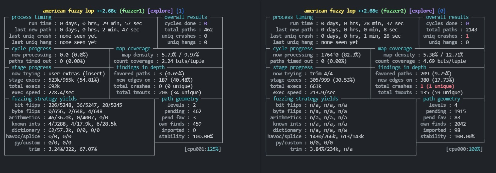

前面都是针对 libxml2 进行模糊测试，这次对二进制程序进行模糊测试。
> PS：通常二进制程序是由一个或多个依赖库组成。 

这篇文章主要是根据 fuzzing010 改编，他的内容主要针对新手，而我的文章则会把前面用过的内容再用一次。

# 下载并且构建目标

下载 xpdf
```bash
# 根据自己喜好创建目录  
cd $HOME/Documents
mkdir fuzzingXpdf && cd fuzzingXpdf/
# 下载构建工具
sudo apt install build-essential
# 下载 Xpdf 3.02：
wget https://dl.xpdfreader.com/old/xpdf-3.02.tar.gz
tar -xvzf xpdf-3.02.tar.gz
```
构建目标并简单使用
```bash
# 构建 Xpdf（--prefix指定安装目录）
./configure --prefix="$HOME/Documents/fuzzingXpdf/install/"
# -j 4 为了加快 make 速度。
make -j 4
make install


# 下载一些 PDF 示例X
cd $HOME/Documents/fuzzingXpdf
mkdir pdfExamples && cd pdfExamples
wget https://github.com/mozilla/pdf.js-sample-files/raw/master/helloworld.pdf
wget http://www.africau.edu/images/default/sample.pdf
wget https://www.melbpc.org.au/wp-content/uploads/2017/10/small-example-pdf-file.pdf


# 测试 pdfinfo
cd ~/Documents/fuzzingXpdf
./install/bin/pdfinfo -box -meta ./pdfExamples/helloworld.pdf
# 测试 pdftotext
 ./install/bin/pdftotext ./pdfExamples/helloworld.pdf output.txt
 cat output.txt
```

# 对目标进行模糊测试

在 Fuzzing010 中，并没有使用 ASAN，而是直接使用 gdb。我还是继续使用 ASAN 叭，方便对 crash 进行判断。首先对二进制程序重新编译
```bash
# 清空
cd ~/Documents/fuzzingXpdf
rm -rf install
cd ~/Documents/fuzzingXpdf/xpdf-3.02
make clean

# 重新编译
# configure 只是生成 makefile
CC=afl-clang-fast CXX=afl-clang-fast++ ./configure --prefix="$HOME/Documents/fuzzingXpdf/install/"
# 设置ASAN模式
AFL_USE_ASAN=1 make -j 4
make install
```
对二进制程序进行模糊测试
```bash
# 多核并行fuzzing
afl-fuzz -i pdfExamples/ -o out -s 123 -x ~/Documents/AFLplusplus/dictionaries/pdf.dict -D -M fuzzer1 -- ./install/bin/pdftotext @@ output
afl-fuzz -i pdfExamples/ -o out -s 234 -x ~/Documents/AFLplusplus/dictionaries/pdf.dict -S fuzzer2 -- ./install/bin/pdftotext @@ output2
```

Fuzzing010 的作者只用了 18 分钟 Orz，我用了 30 分钟跑出 crash

