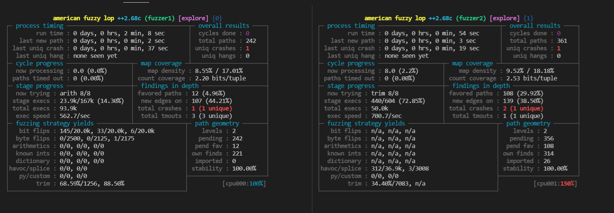

案例来自 Fuzzing010

# 如何选择插桩工具？

在这个案例中主要是学习了如何选择插桩工具。翻译如下所示

```
+--------------------------------+
| clang/clang++ 11+  | --> 使用 LTO 模式 (afl-clang-lto/afl-clang-lto++)
+--------------------------------+    具体查看 https://github.com/AFLplusplus/AFLplusplus/blob/stable/instrumentation/README.lto.md
    |
    | 如果不满足条件，或者如果目标无法使用 LTO 模式
    |
    v
+---------------------------------+
| clang/clang++ 6.0+ | -->  使用 LLVM 模式(afl-clang-fast/afl-clang-fast++)
+---------------------------------+   具体查看 https://github.com/AFLplusplus/AFLplusplus/blob/stable/instrumentation/README.llvm.md
    |
    | 如果不满足条件
    |
    v
 +--------------------------------+
 | gcc 5+           | -> 使用 GCC_PLUGIN 模式 (afl-gcc-fast/afl-g++-fast)
 +--------------------------------+    具体查看 https://github.com/AFLplusplus/AFLplusplus/blob/stable/instrumentation/README.gcc_plugin.md
    |
    | 如果不满足条件
    |
    v
   使用 GCC 模式 (afl-gcc/afl-g++) (or afl-clang/afl-clang++ for clang)
```


# 编译使用

= =，Fuzzing010 教程每次都使用 gcc 先编译一次，删除后再使用插桩工具编译（应该是为了确保程序能正常编译）。我这直接偷懒使用插桩工具安装了。

```bash
# 创建文件夹
cd $HOME/2022
mkdir fuzzing_libexif && cd fuzzing_libexif/
# 下载 libexif
wget https://github.com/libexif/libexif/archive/refs/tags/libexif-0_6_14-release.tar.gz
tar -xzvf libexif-0_6_14-release.tar.gz
# 安装依赖
sudo apt-get install autopoint libtool gettext libpopt-dev
# 编译
autoreconf -fvi
CC=afl-clang-lto ./configure --enable-shared=no --prefix="$HOME/2022/fuzzing_libexif/install/"
AFL_USE_ASAN=1 make -j 4
make install
# 我在make install的时候发现有error信息，不过可以正常得到依赖文件，就没管了
```

下载并编译 Harness（调用该 libexif 的应用程序）
```bash
# 下载并解压
cd $HOME/2022/fuzzing_libexif
wget https://github.com/libexif/exif/archive/refs/tags/exif-0_6_15-release.tar.gz
tar -xzvf exif-0_6_15-release.tar.gz

# 编译安装
cd exif-exif-0_6_15-release/
autoreconf -fvi
./configure --enable-shared=no --prefix="$HOME/2022/fuzzing_libexif/install/" PKG_CONFIG_PATH="$HOME/2022/fuzzing_libexif/install/lib/pkgconfig"
AFL_USE_ASAN=1 make -j 4
make install
```

尝试简单使用
```bash
./install/bin/exif
```

下载测试种子
```bash
sudo apt install unzip

cd $HOME/2022/fuzzing_libexif
wget https://github.com/ianare/exif-samples/archive/refs/heads/master.zip
unzip master.zip
# 测试
./install/bin/exif ./exif-samples-master/jpg/Canon_40D_photoshop_import.jpg
```

# 模糊测试

使用下面的命令进行模糊测试
```bash
afl-fuzz -i exif-samples-master/jpg/ -o out -s 123 -x ~/2022/AFLplusplus/dictionaries/exif.dict -D -M fuzzer1 -- ./install/bin/exif @@

afl-fuzz -i exif-samples-master/jpg/ -o out -s 345 -x ~/2022/AFLplusplus/dictionaries/exif.dict -D -S fuzzer2 -- ./install/bin/exif @@
```

不到 1 分钟就有 crash 了，orz



运行了 1 h，大约获得了 22 个 crash。

# crash

这次开始使用 crash 自动分类的工具——AFLTriage。不过最后的效果不是很理想，打算重新跑一遍 Fuzz，再进行一次分类。

今天主要了解编译和使用方法
```bash
git clone https://github.com/quic/AFLTriage.git
cd AFLTriage
cargo build --release
# 编译后可执行文件保存在 target/release 目录中。
```

在这里我遇到了两个网络问题，首先是 github clone 不下来，其次是 cargo 更新依赖失败。
```bash
# git
# 设置代理
export http_proxy=http://192.168.1.1:7890 && https_proxy=http://192.168.1.1:7890
# 设置DNS
sudo su 
echo "199.232.69.194 github.global-ssl.fastly.net
> 140.82.112.4 github.com" >> /etc/hosts
exit

# cargo
# 在 ~/.cargo/config 中写入
[http]
proxy = "192.168.1.1:7890"

[https]
proxy = "192.168.1.1:7890"
```
使用 AFLTrige 进行分类
```bash
./../AFLTriage/target/release/afltriage -i out -o reports ./install/bin/exif @@
# -i：指定 afl 的输出目录
# -o：指定分类的结果保存位置
# ./install/bin/exif @@ 类似 AFL，是程序的执行命令。
```
最后的输出结果可以通过 `ls -al `进行查看
```bash
$ ls -al reports/
total 104
drwxrwxr-x 2 joe joe 4096 Mar 10 14:42 .
drwxrwxr-x 8 joe joe 4096 Mar 10 14:42 ..
-rw-rw-r-- 1 joe joe 9080 Mar 10 15:07 afltriage_ASAN_heap-buffer-overflow_READ_exif_get_long_c83771bb01cac99946f13874291cc1a9.txt
-rw-rw-r-- 1 joe joe 9211 Mar 10 15:07 afltriage_ASAN_heap-buffer-overflow_READ_exif_get_long_f4c0a4415857aa48d7c9cf689b2eea53.txt
-rw-rw-r-- 1 joe joe 9191 Mar 10 15:07 afltriage_ASAN_heap-buffer-overflow_READ_exif_get_srational_3b9309060e657a4b8cf01e96bb4c1d51.txt
-rw-rw-r-- 1 joe joe 9318 Mar 10 15:07 afltriage_ASAN_heap-buffer-overflow_READ_exif_get_srational_4a7e1151a5ab311dd6c4baea82b15a74.txt
-rw-rw-r-- 1 joe joe 4352 Mar 10 15:07 afltriage_SIGSEGV_exif_get_short_849c8acefe40c0cef60471af2a4d1d34.txt
-rw-rw-r-- 1 joe joe 4439 Mar 10 15:07 afltriage_SIGSEGV_exif_get_short_97c75c5bacc0879e21d39b0a5248129b.txt
-rw-rw-r-- 1 joe joe 5063 Mar 10 15:07 afltriage_SIGSEGV___memmove_sse2_unaligned_erms_2d8ecddb9e4a964a90010a4331ceb46c.txt
-rw-rw-r-- 1 joe joe 4866 Mar 10 15:07 afltriage_SIGSEGV___memmove_sse2_unaligned_erms_374cd3ced7a798dab4fd73ded96799a8.txt
-rw-rw-r-- 1 joe joe 5026 Mar 10 15:07 afltriage_SIGSEGV___memmove_sse2_unaligned_erms_d225fb22089b51364d435e87c5ed4b79.txt
-rw-rw-r-- 1 joe joe 6384 Mar 10 15:07 afltriage_SIGSEGV___memmove_sse2_unaligned_erms_d8d3f1a2cd1e9067f9a2e61fc307ff9b.txt
```

参考教程：
- [Fuzzing101 with LibAFL - Part II: Fuzzing libexif](https://epi052.gitlab.io/notes-to-self/blog/2021-11-07-fuzzing-101-with-libafl-part-2/#triage)
- [【完美解决】git clone速度太慢的问题](https://blog.csdn.net/u013277209/article/details/108344344)