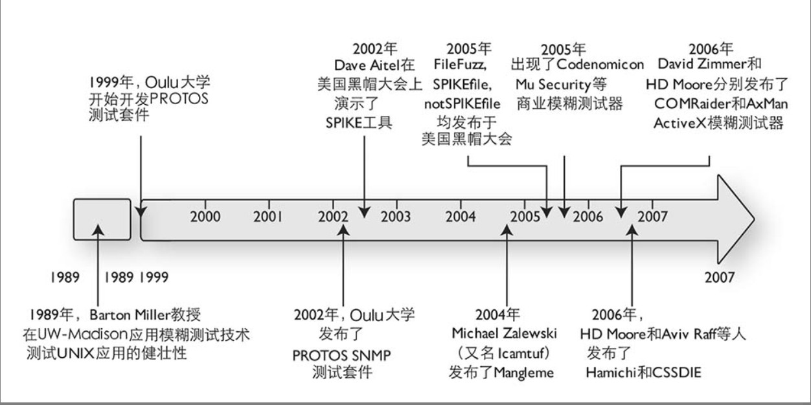

# 定义

fuzzing 的中文叫做模糊测试，模糊测试是一个安全漏洞发现学（漏洞挖掘）中的一种技术，在过去的二十年里，模糊测试已经成为软件安全的支柱。使用模糊测试在各种软件中发现了数以千计的安全漏洞。

这里就不再介绍安全漏洞是什么、安全漏洞有哪些危害，相信大家已经在新闻中有所耳闻，如果没有就去搜索 `log4j新闻`。

再稍微介绍一下漏洞挖掘，漏洞挖掘大致分为 3 种，每一种方法都有各自的优缺点。既没有绝对正确的方法，也没有任何一种单一方法可以发现特定目标的所有安全漏洞。
- 白盒测试：有源码。常见技术有代码审计、程序分析（静态分析、动态分析）、符号执行和约束求解。
- 黑盒测试：无源码。常见技术有手动测试、模糊测试。
- 灰盒测试：黑盒测试+逆向分析。常见技术有逆向工程。可以用来提高黑盒测试的效率和准确度。

其中模糊测试采用的方法是：反复向应用程序输入非预期的数据，并在输入的同时监控输出中的异常。

下面用一个简单的案例来类比一下模糊测试（摘自《模糊测试：强制挖掘安全漏洞的利器》），下面的例子将模糊测试类比成如何闯进一所房子。

假设你不幸丢了工作，不得不以犯罪为生。现在你想要破门进入一所房子来盗窃。

如果采用纯白盒测试的方法，你需要在破门前得到房子的所有相关信息，包括房子的蓝图（blueprints），房子的锁的生产厂家、房子的建筑材料等。显然，白盒测试放在这种情况下有独特的好处，但也并非万无一失。应用白盒测试方法，你需要对房子进行静态分析而不是进行运行时（实际进入房子时）检查。例如，通过静态分析你发现这所房子起居室的侧面窗户有一个漏洞，可以把窗户打碎进入房子。但你肯定没办法预见到你进入后的事情，也许当你进入以后，发现愤怒的房主正在屋里拿着枪等着你。

另外，你可以采用黑盒测试方法来进入这所房子。采用黑盒测试方法，你可以在黑暗的掩护下接近房子，悄悄测试所有的门和窗户，向房子内窥视以决定最好的突破口。但是，如果你最终选择使用模糊测试方法进入这所房子，你可以既不用研究房子的蓝图、也不用手工尝试所有那些锁，只需要选择一种武器并让进入房子的过程完全自动化——这就是强制安全漏洞发现方法的威力！

# 历史

想知道一个东西是什么？最好的方式就是看他的历史。想知道一个东西未来可能长什么样子？最好的方式也是看他的历史，大部分时候是奏效的。

那我们就来看看模糊测试的历史吧。
- 1988年，威斯康星大学的 Barton Miller 提出模糊测试的概念，并公布了他们工作的源代码、测试流程以及原始结果数据（以前可能也有类似的成果，但他是第一个将这种方法系统阐述出来的人）。Miller 的模糊测试方法非常粗糙，如果某个输入导致应用崩溃或是挂起，意味着测试失败，否则就意味着测试成功。
- 1999年，芬兰奥卢大学开始创建 PROTOS 测试套件（在 2002 年发布）。PROTOS 测试套件首先分析协议规范，然后生成违反协议的数据包来测试应用的崩溃情况。
- 2002年，Dave Aitel 在开源社区发布了**基于模板的模糊测试器** SPIKE，随后还发布了 Unix 模糊测试器 ShareFuzz。基于模板的模糊测试器主要用于协议和文件的模糊测试，例如HTTP。这种方法依赖于安全人员结合自己的知识，给出输入数据的模板，构造输入测试数据。书中的例子不是很容易理解，可以考虑看看这篇文章——[漏洞挖掘之乱拳打死老师傅——Fuzzer](https://www.anquanke.com/post/id/161719#h2-2)。
- 2003年，`PROTOS` 项目组成立 Codenomicon 公司，并将 Fuzzing 技术应用于商业公司，很多年后挖出了著名的“心脏滴血”漏洞。
- 2004年
    - Michal Zalewski（又名 lcamtuf，没错，就是 AFL 的作者）将模糊测试导入 Web 浏览器测试并发布了 mangleme 工具。Mangleme 工具是一个通用网关界面程序（CGI），它持续产生不正常的HTML文件，并强制浏览器反复刷新来加载这些 HTML 文件。
    - 同年，**文件模糊测试开始兴起**。微软发布了 MS04-28 安全公告，该公告详细描述了 JPEG 文件处理引擎中的一个缓冲区溢出漏洞。在这种情况下，文件格式安全漏洞成为了基于变异的模糊测试方法的主要目标，由于已经有了一些导致安全漏洞的文件格式样本，因此可以一边让快速连续发生变异，一边监控被测应用的输出以找到安全漏洞。出现了大批相关的模糊测试工具，如 **FileFuzz，SPIKEfile 和 notSPIKEfile，Peach**。
> PS：在 riusksk 师傅的《Fuzzing技术发展的这30年》一文中提到文件Fuzzing和网络协议Fuzzing的关系，在此摘录一下。
>
> 文件 Fuzzing 应该是当前 Fuzzing 应用中最为普遍的形式，即使是网络协议等其它目标的 Fuzzing，也是可以转换为文件 Fuzzing 的。比如 OpenSSL 网络协议 Fuzzing，通过源码打 Log 的方式先收集网络数据为本地文件，再调用其 API 写个 hareness 用 AFL 或 libfuzzer 进行本地测试，就顺利地将网络协议 Fuzzing 转换为文件 Fuzzing。 
- 2005年，一个名为 Mu Security 的公司开始开发一种硬件模糊测试工具，该工具用于让网络中传输的协议数据发生变异。
- 2006年
    - H.D.Moore 和 Aviv Raff 发布了 Hamachi 工具，该工具用来对浏览器解析动态 HTML 的功能进行模糊测试。随后又发布了 CSSDIE，该工具对浏览器解析重叠样式表（CSS）功能进行模糊测试。
    - David Zimmer 发布了 COMRaider，H.D.Moore 发布了 AxMan。这两个工具都用于对 IE 中的 ActiveX 控件进行模糊测试。 
- 2008年，Mozilla 安全团队发布了 jsfunfuzz 和 DOMfuzz，和 2002 年发布的 SPIKE 一样，都是**基于模板的模糊测试器**。使用该工具挖掘漏洞依赖于对语法和目标原理的理解，才能构造出好的语法模板。
- 2012年，USENIX 安全顶会上发布一篇论文“Fuzzing with code fragments”，并公布了一款名为 LangFuzz 的工具，该工具主要对语法解析引擎进行模糊测试。
- 2013年，Google 的 Michal Zalewski（lcamtuf）开发的 afl-fuzz 发布了，这是一款**基于覆盖率引导**的模糊测试工具，该软件首次采用源码编译插桩和 QEMU 模式来实现代码覆盖引导 Fuzzing ，并且还采用了遗传算法来提高测试用例的代码覆盖率。Fuzzing 技术发展历程中最重要的一次里程碑。AFL 主要被用于文件 Fuzz，在 2014 年到 2015 年之间挖到了不少开源软件的 0 day。
- 2015年，Google 开源了 syzkaller，这是一款用于 Fuzzing Linux 内核的工具，漏洞产出特别高。该工具通过定义函数调用模板，在模板中定义系统调用参数类型，从而解决系统调用的顺序依赖和值依赖问题。
- 2016年，Google 提出了“结构感知型fuzz”，并开源了相关的工具——libprotobuf-mutator。
- 2018年，Google 的 Samuel Groß 开源了 fuzzilli，该工具是一款 JS 语法 Fuzz 工具，整合了语法编译、模板生成、覆盖引导等多种技术。它使用自定义的中间语言用于语法编译，再将变异后的中间语言转换成 JS 代码。
- 2019年，有两款 Fuzz 工具发布，他们都引用了 2012 年的论文“Fuzzing with code fragments”中的思想。  

待续……

用图片展示 Fuzzing 的发展史（1988 -> 2007），图片来自于《模糊测试：强制挖掘安全漏洞的利器》

# 发展

这里主要介绍未来的应用方向。主要参考 riusksk 师傅的《洞察与思考Fuzzing技术发展趋势》文章（PS：自己水平不够）。

**方向一、逻辑型探索化**

近年来出现了很多内存安全型的语言，如 golang、rust 等。当这些语言逐渐普及并大量运用，在内存安全上挖掘漏洞的难度会大大增加。

逻辑漏洞虽然不及内存漏洞破坏力大，但合理运用还是会造成较大的威胁。目前Fuzzing工作都大量集中在内存安全上，在挖掘逻辑漏洞的探索上还比较少。如果能突破Fuzzing在挖掘逻辑漏洞上的难题，那将开启Fuzzing的新纪元。

**方向二、软硬件结合**

Fuzzing 和机器学习一样，都需要大量的运算做支撑，软硬件结合能大幅提升其运算效率。更高的效率，意味着程序可以探索更大规模的路径，理论上更有可能挖到漏洞。

**方向三、智能化**

人工智能在Fuzzing中的优势还未体现，但随着时间的变化，这样的局面有很大可能会改变。

下象棋就是一种需要大量应用路径探索的活动，Fuzzing更是如此。

**方向四、CI/CD 集成化**

Fuzzing 由最初的“基于模板的模糊测试器”到现在的“基于变异的模糊测试其”，逐渐从“依赖人工”逐渐转化为“自动测试”，为 CI/CD 中的自动化集成测试提供了基础。

随着 DevSecOps 的流行，安全左移的思想逐渐被大家所接受，希望尽可能早的发现漏洞，而不是遗留到大型系统中。

这里还有两篇拓展阅读的文章：

1、[微软Blog-模糊测试的简要介绍以及为什么它是开发人员的重要工具](https://www.microsoft.com/en-us/research/blog/a-brief-introduction-to-fuzzing-and-why-its-an-important-tool-for-developers/)

2、[Google-Fuzzing介绍](https://github.com/google/fuzzing/blob/master/docs/intro-to-fuzzing.md)

---

你甚至不肯叫我一声 Fuzzer——教父。

国内大部分的安全博客都在各种内容之间反复横跳，我作为初学者也很茫然，东学一点，西学一点，然后忘光光。——自学安全一年的体会。