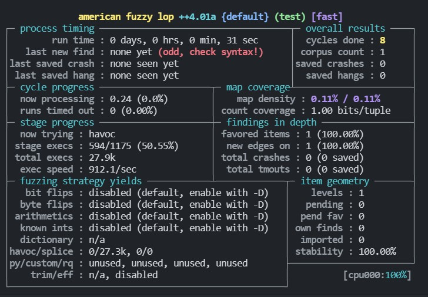

AFL++ 是基于 AFL 进行拓展的一个项目，将 AFL 相关的项目整合到一起。其主要是由 C 语言编写，因此建议选择采用 Linux 来搭建相关的环境。

这里推荐采用 Ubuntu 20.04，后面在实践 Fuzz101 项目的时候会比较方便。

我在安装的时候遇到了以下的问题。

**1、Ubuntu切换国内源**

Ubuntu 20.04 的源和 16.04 的源不一样，采用 16.04 会出现一些比较奇怪的错误（找不到依赖啥的），建议改用下面的源
```
deb http://mirrors.aliyun.com/ubuntu/ focal main restricted universe multiverse
deb-src http://mirrors.aliyun.com/ubuntu/ focal main restricted universe multiverse
deb http://mirrors.aliyun.com/ubuntu/ focal-security main restricted universe multiverse
deb-src http://mirrors.aliyun.com/ubuntu/ focal-security main restricted universe multiverse
deb http://mirrors.aliyun.com/ubuntu/ focal-updates main restricted universe multiverse
deb-src http://mirrors.aliyun.com/ubuntu/ focal-updates main restricted universe multiverse
deb http://mirrors.aliyun.com/ubuntu/ focal-proposed main restricted universe multiverse
deb-src http://mirrors.aliyun.com/ubuntu/ focal-proposed main restricted universe multiverse
deb http://mirrors.aliyun.com/ubuntu/ focal-backports main restricted universe multiverse
deb-src http://mirrors.aliyun.com/ubuntu/ focal-backports main restricted universe multiverse
```
相关的命令有：
```bash
sudo cp /etc/apt/sources.list /etc/apt/sources.list.backup
vim /etc/apt/sources.list
sudo apt update
sudo apt-upgrade
```

**2、UnicornAFL报错**

切换源之后，就可以安装相关的依赖了。
```bash
sudo apt-get install git build-essential curl libssl-dev sudo libtool libtool-bin libglib2.0-dev bison flex automake python3 python3-dev python3-setuptools libpixman-1-dev gcc-9-plugin-dev cgroup-tools \
clang-11 clang-tools-11 libc++1-11 libc++-11-dev libc++abi1-11 libc++abi-11-dev libclang1-11 libclang-11-dev libclang-common-11-dev libclang-cpp11 libclang-cpp11-dev liblld-11 liblld-11-dev liblldb-11 liblldb-11-dev libllvm11 libomp-11-dev libomp5-11 lld-11 lldb-11 python3-lldb-11 llvm-11 llvm-11-dev llvm-11-runtime llvm-11-tools
# clang 重命名
sudo update-alternatives --install /usr/bin/clang clang `which clang-11` 1
sudo update-alternatives --install /usr/bin/clang++ clang++ `which clang++-11` 1
sudo update-alternatives --install /usr/bin/llvm-config llvm-config `which llvm-config-11` 1
sudo update-alternatives --install /usr/bin/llvm-symbolizer llvm-symbolizer `which llvm-symbolizer-11` 1

git clone https://github.com/AFLplusplus/AFLplusplus
```
然后进入AFL++的文件夹进行编译安装
```bash
cd AFLplusplus
git checkout 2.68c      # 切换到特定版本

make distrib            # 全部编译
sudo make install
# 编译 LLVM mode
cd llvm_mode
make clean
make all

# 配置软链接
sudo ln -s ~/Documents/AFLplusplus/afl-clang-fast /usr/local/bin/afl-clang-fast
sudo ln -s ~/Documents/AFLplusplus/afl-clang-fast++ /usr/local/bin/afl-clang-fast++

# 在使用afl-clang-fast之前，需要指定AFL_PATH，使其可以找到`afl-llvm-rt.o` 和 `afl-llvm-pass.so`
export AFL_PATH=~/Documents/AFLplusplus
afl-clang-fast --version # 判断 afl-clang-fast 是否安装成功。

# 配置Qemu_mode
cd qemu_mode/
./build_qemu_support.sh
cd qemu-3.1.1/
sudo make install
cd ~/Document/AFLplusplus
sudo make install
```

**三、测试是否安装成功**

首先创建一个`in`文件夹，在in文件夹中里面创建一个文件并写入任意数据，然后使用下面的命令判断AFL是否正常安装（需要配置 Qemu mode）。
```bash
sudo bash -c "echo core >/proc/sys/kernel/core_pattern"        # 修改崩溃后转储的方式。
afl-fuzz -Q -m none -i in -o out test @@
```
如果AFL成功安装，即可出现如下图所示的状态


参考文档：
- [ubuntu20.04 LTS 更换国内163源、阿里源、清华源、中科大源](https://www.cnblogs.com/zqifa/p/12910989.html)
- [Building and installing AFL++](https://github.com/AFLplusplus/AFLplusplus/blob/stable/docs/INSTALL.md)
- [AFL++实战（一）-黑盒测试FFmpeg](https://blog.csdn.net/qq_36711003/article/details/107016408?spm=1001.2014.3001.5502)
- [Ubuntu 20.04.3 LTS (Focal Fossa)](https://releases.ubuntu.com/20.04.3/)
- [AFL的LLVM_Mode](https://kiprey.github.io/2020/07/AFL-LLVM-Mode/#3-afl-clang-fast-%E5%B0%8F%E5%8F%99)
