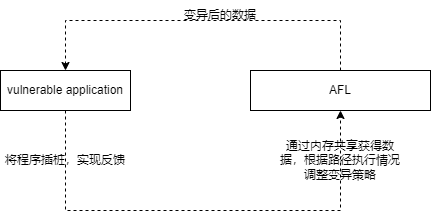
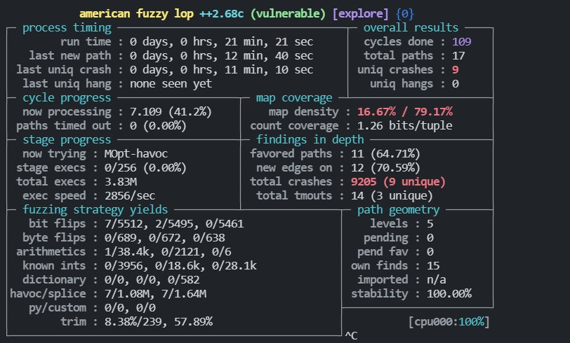
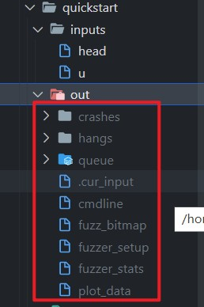

本篇文章的主要目标是熟悉 AFL 的基本使用，主要基于 afl-training 项目的源码。步子迈大了容易扯着蛋，一步步来。

# 基础

AFL 包含很多命令行工具，其中最核心的工具就是 `afl-fuzz`。简化的 AFL 原理如下所示



通过图片可知，AFL 需要运行起来需要准备以下的东西：
```
1、变异初始的种子。
2、插桩后的二进制程序。
```

# 实战

下载 afl-training，并进入 quickstart 目录
```
git clone https://github.com/mykter/afl-training.git
cd afl-training/quickstart
```
在 quickstart 文件夹中，已经准备好了变异使用的种子（inputs 目录下），还有用来模糊测试的源码（vulerable.c），所以我们只需要准备一个插桩后的二进制程序即可。

AFL提供了编译工具（afl-gcc、afl-clang、afl-clang-fast 等等），可以将源码编译成插桩后的二进制程序。这里我们使用 AFL 提供的编译器来生成可执行文件：
```bash
CC=afl-clang-fast AFL_HARDEN=1 make
# CC 是 Makefile 的变量，用于指定编译器。
# AFL_HARDEN：促使 CC 自动化代码加固，试得检测简单的内存 bug 更加容易。
# make 后不跟任何参数，默认生成第一个目标，此处第一个目标是 all。
```
运行二进制程序，并尝试输入数据（简单探索一下目标，分析入口点）。
```bash
$ ./vulnerable
# Press enter to get usage instructions.
# Test it on one of the provided inputs:
$ ./vulnerable < inputs/u
```
进行模糊测试。
```bash
$ afl-fuzz -i inputs -o out ./vulnerable
```
我运行 21 分钟的效果如下所示（生成了 9 个 uniq crash）：


再来看看 AFL fuzzing 的结果。



1、crashes 文件夹中有 9 个 id 开头的文件和 1 个 README.txt 文件，这些文件中的数据都能导致 vulnerable 程序崩溃（可能存在漏洞），这里的 9 和前面提到的 uniq crash 的数量是相同的。

2、hangs 文件夹中没有得到任何文件，也就是生成的数据没有导致程序运行超时。

3、queue 文件夹中有 17 个文件，其中每个文件都会导致产生不同的执行路径。

4、cmdline 文件记录了执行程序的命令（被攻击的程序）。

5、fuzz_bitmap 文件记录了程序分支的执行情况。

6、fuzzer_setup 和 fuzzer_status 文件 分别记录了 afl-fuzz 的设置 和运行状态。

7、plot_data 记录了 fuzzer_stats 的关键数据变化情况，可以使用 afl-plot 绘图。

# 分析

afl-training 教程到这里就没有东西了，但总觉得缺少点什么。

**1、入口点分析**

入口点分析在 Web 安全中非常重要，这个步骤通常在信息搜集的时候完成。

在 Web 中，我们可以通过扫描器 + 字典来确定 Web 程序的路径，从而确定入口。在二进制程序中，我们可以通过阅读文档、逆向等方式来确定程序的入口点。

在这个 `vulnerable` 程序中，有详尽的文档来参考，通过阅读文档，我们即可找到所有的入口点，以及相关的功能。
```
Usage: ./vulnerable
Text utility - accepts commands and data on stdin and prints results to stdout.
Input             | Output
------------------+-----------------------
u <N> <string>    | Uppercased version of the first <N> bytes of <string>.
head <N> <string> | The first <N> bytes of <string>.
```
从上述的文档中可知，vulnerable 程序共有两种模式，即 u 和 head 模式。u 模式可以将字符串的前 N 个字符转换成大写。head 模式可以截取字符串的前 N 个字符。

程序的入口大致就是这两个位置。如果是非开源的程序，或者图形化的程序可能需要逆向来进一步确认。

**2、不安全状态**

我对二进制漏洞了解得不多，根据其功能只能猜测出以下漏洞：
- 整数溢出
- 缓冲区溢出（栈溢出和堆溢出）
> PS：不安全状态往往是和功能相关联的（上下文型漏洞）。


**3、路径探索**

AFL 主要作用是探索出入口到不安全状态的路径（抽象的路径）。AFL 并不是万能的，我们需要人为投喂入口信息，教它如何识别漏洞（作者已经预置了一些识别的方法）。

理论部份谈完了，接下来就是看看 afl-fuzz 得到的结果是否有我们想要的答案了（分析 crashes）。


参考文档：
- [[Fuzzing with AFL] Fuzzing simple C program with AFL on Linux](https://www.youtube.com/watch?v=NiGC1jxFx78&list=PLHGgqcJIME5kYhOSdJjvtVS4b4_OXDqM-&index=2)
- [Damn_Vulnerable_C_Program](https://github.com/hardik05/Damn_Vulnerable_C_Program)
- [Fuzzing with AFL workshop](https://github.com/mykter/afl-training)

