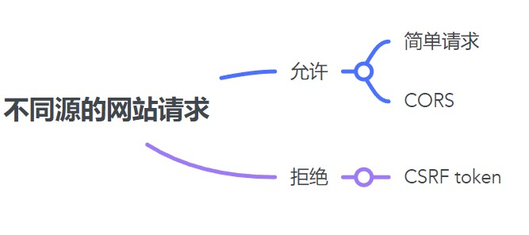

周末没啥事，打 CTF 顺便增强对于漏洞挖掘的理解。fuckCORS？

# 入口点分析

- /index.php：账号登录。
- /change.php：改变权限。

# 不安全状态分析

根据题目中的提示的 `normal admin can see the flag`，应该是需要将自己的账户提升为 admin 才可以。

在 /change.php 页面中也提供了类似的提权的功能，但是没有描述出提权的要求（似乎正常网站也不会提供这样的功能）。

根据题目名称可以大致猜到漏洞的类型——CORS 绕过。

经过上述的简单分析，我们可以得到一个大致的探索路线，按照探索路线去学习和分析，大概率不会出问题。
- CORS：探索网站的功能如何实现 CORS（需要学习 CORS 漏洞的条件，找到满足该题的 CORS 类型）
- 权限提升（利用 CORS 进行权限提升，获得 flag）

---

**CORS 的脆弱性** 

不会 CORS 相关的攻击，只能通过学习并理解 CORS 的核心，然后再通过核心来对该题进行分析（只是简单的学习通常做不出来）。

CORS 漏洞主要是针对客户端的漏洞，而不是服务端。~~在该题中并没有需要攻击的 admin 对象~~。又看了一眼题目，应该是通过 report 位置来攻击 admin，从而获得 admin 的 cookie，最后登录网站获取 flag。
```
fxxkcors
challenge:
http://124.71.205.122:10002/

report:
http://123.60.71.144:3000/fxxkcors
http://159.138.56.26:3000/fxxkcors
http://119.13.125.234:3000/fxxkcors
```
这个 report 采用 Google 的验证码，真恶心啊，尝试了很多次都是 `Failed captcha verification`。

原因论：CORS 的脆弱性是由于开发人员对配置错误导致的，而非 CORS 脆弱，这属于一种上下文相关的漏洞（不同人有不同的配置方法），需要根据应用的上下文来判断是否存在漏洞。

目的论：**由于浏览器的限制，网站 A 不能直接访问网站 B，其不期待的状态就是——网站 A 可以访问网站 B（目的）**。CORS 脆弱性在于网站 B 开发者可以通过配置来实现不安全状态，攻击者就可以直接利用这种不安全状态，让用户访问网站 A （攻击者持有）时将网站 B 的 Cookie 发送给攻击者。

开始寻找该网站哪些地方存在 CORS 失效。

自己没有这方面的知识储备，不清楚应该如何做出来这道题，第二天根据其他师傅的提示做出来了,主要参考了这篇文章——[《how to be popular》](https://blog.azuki.vip/csrf/)

# 路径探索

**入口->CORS**

~~待续……~~

先引用一张图来说明 CORS 机制的作用。


> PS：想要以一种上帝视角来审视这道题，结果发现太难了，一直停止不前。


---

# 重新开始：基本概念

这里主要涉及 3 个主要概念：
- SOP（Simple Origin Policy）：同源策略。
- CSRF（Cross Origin Resource Share）：跨站资源共享。
- CORS（Cross Site Requst Forgery）：跨站请求伪造。

看完上面的概念依然还是模模糊糊？那么我们再来梳理一下，SOP 是一种浏览器的安全策略，主要是限制不同源的网站的请求。也就是说，**浏览器会在某些情景下，不允许网站向另一个网站发起请求**（并不会限制所有的请求）。

CORS 是一种 HTTP 的机制，可以让浏览器允许跨站的请求。不过需要服务器允许的情况。

CSRF 是一种攻击方式。当被害者访问恶意网站，导致自己在另一个的 cookie 被利用，这种攻击方式成为 CSRF。SOP 正是限制这种攻击方式的有效策略，但是依然需要网站开发者的支持。大致整理一下，就可以得到如下的思维导图



# 复现题目


# 进一步探索


参考文章：
- [浅析CORS攻击及其挖洞思路](https://xz.aliyun.com/t/7242#toc-8)
- [how to be popular](https://blog.azuki.vip/csrf/)
