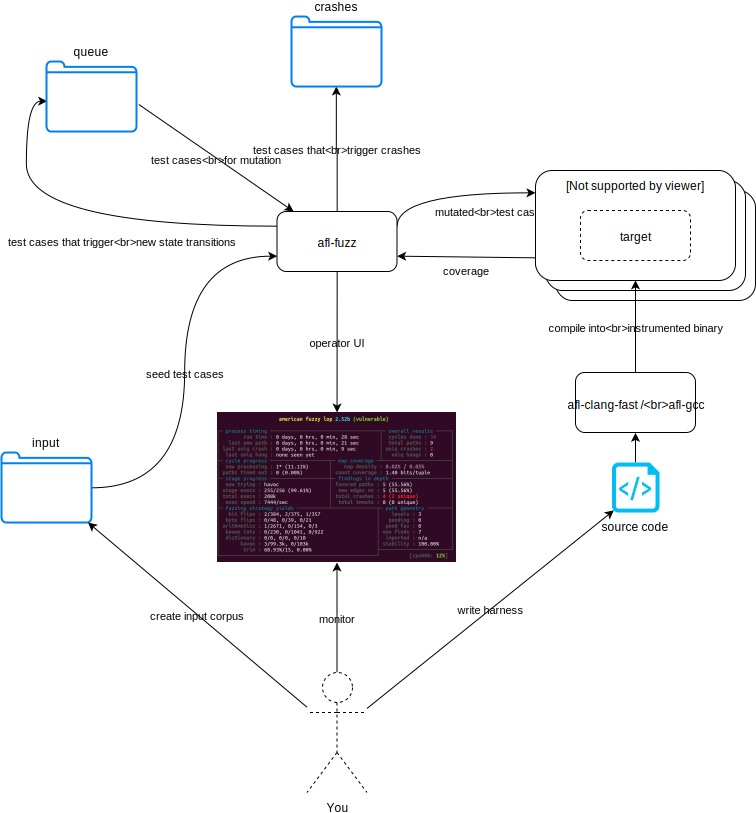
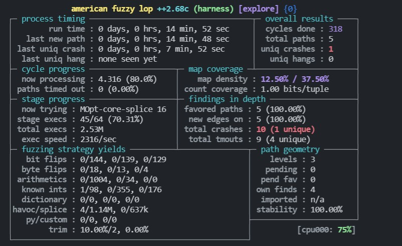

在开始尝试理解漏洞之后，并没有学习的方向。刷 CTF 题？看 CVE？看议会？最近在逛 TK 教主的微博的时候，发现他在 2018 年发了 DEFCON 1-24，可以作为不错的学习资料（下不了）。
> PS：自顶向下的学习方式。

目前博客共三个分支——Haskell、理解漏洞、Fuzzing，后两个主题主要是针对漏洞挖掘，第一个主题则是对入门解决编程语言安全问题。

flag 越立越多，先专注于 fuzz 吧（把网上的教程过一遍再尝试自己探索，站在巨人的肩膀上）。
> blog 只是根据记录自己的思想，让自己知道自己在做什么和思考什么，可能会比较乱。

---

这篇文章主要是了解 Harness。

# Harness介绍

除了一般的软件有漏洞，底层的依赖库也有可能存在漏洞。这些依赖库通常都只是申明，并没有具体的调用（无法运行）。Harness 就是这个调用程序，用来连接依赖库和 AFL。具体数据流如下所示



# example

首先假设存在这样一个依赖库，有下面这两种函数（具体实现代码在 code 文件夹中）
```c
#include <unistd.h>
// an 'nprintf' implementation - print the first len bytes of data：打印前len个字符
void lib_echo(char *data, ssize_t len);

// optimised multiply - returns x*y：返回 x*y
int  lib_mul(int x, int y);
```
我们可以尝试简单使用这个lib库
```c
#include "library.h"
#include <string.h>
#include <stdio.h>

void main() {
    // 尝试调用函数（程序没有外部输入）。
    char *data = "Some input data\n";
    lib_echo(data, strlen(data));
    printf("%d\n", lib_mul(1,2));
}
```
上面的代码主要可以**调用lib库**，但依然不能作为 Harness，Harness还需要**与 AFL 交互**，所以需要有输入的接口。可以将上面的代码进一步改写成下面的样子
```c
// 测试 lib_echo 函数（控制一些不是很关键的变量）
#include <unistd.h>
#include <string.h>
#include <stdio.h>

#include "library.h"

// fixed size buffer based on assumptions about the maximum size that is likely necessary to exercise all aspects of the target function
// 固定缓冲区大小，设置最大值是必要的。
#define SIZE 50

int main() {

	// make sure buffer is initialized to eliminate variable behaviour that isn't dependent on the input.
	// 初始化缓冲区大小，消除不依赖于变量的行为（控制变量）
	char input[SIZE] = {0};

	ssize_t length;
	// 从标准输入读取数据。数据存入 input 数组，数组长度为 SIZE。
	length = read(STDIN_FILENO, input, SIZE);

	lib_echo(input, length);
}
```
上面的程序，既可以和 AFL 交互，又可以调用依赖库，可以作为简单的Harness了。那么怎么使用上面的代码呢？

首先使用下面的命令来编译 harness.c
```bash
AFL_HARDEN=1 afl-clang-fast harness.c library.c -o harness
```
然后就可以使用 AFL 来进行模糊测试了。
```bash
afl-fuzz -i in -o out ./harness
```
下面是我运行 14 分钟的结果。



afl-fuzz 发现了 1 个 crash 案例，造成 crash 的输入为
```
pop!
```


# 任意输入格式

接下来测试 lib_nul 函数，这个函数需要两个输入，应该如何解决呢？三个参数呢？作者给出的 harness 如下，关键在于 19 到 25 行。harness 按照 int 的大小来读取，从而将一行输入拆分成多个输入。
```
#include <unistd.h>
#include <string.h>
#include <stdio.h>

#include "library.h"

// fixed size buffer based on assumptions about the maximum size that is likely necessary to exercise all aspects of the target function
#define SIZE 100

int main(int argc, char* argv[]) {
    if((argc == 2) && strcmp(argv[1], "echo") == 0) {
        // make sure buffer is initialized to eliminate variable behaviour that isn't dependent on the input.
        char input[SIZE] = {0};

        ssize_t length;
        length = read(STDIN_FILENO, input, SIZE);

        lib_echo(input, length);
    } else if ((argc == 2) && strcmp(argv[1], "mul") == 0) {
        int a,b = 0;
        read(STDIN_FILENO, &a, 4);
        read(STDIN_FILENO, &b, 4);
        printf("%d\n", lib_mul(a,b));
    } else {
        printf("Usage: %s mul|echo\n", argv[0]);
    }
}
```
如何启动这个 harness 呢？
```bash
afl-fuzz -i in -o out ./harness echo
afl-fuzz -i in -o out ./harness mul
```
上面的 harness 测试了两个函数，需要 2 个 afl-fuzz 进程。我们还可以利用上面的思想把三个参数（input、a、b）整合到一行，将前 8 个字节用作的 `lib_mul` 的输入，并将任何剩余字节用作的输入 `lib_echo`。
```c
#include <stdio.h>
#include <unistd.h>
#include "library.h"

#define SIZE 108

int main(int argc, char *argv[])
{
    char input[SIZE] = {0};
    int a, b;
    read(STDIN_FILENO, &a, 4);
    read(STDIN_FILENO, &b, 4);
    printf("%d\n", lib_mul(a, b));

    ssize_t length;
    length = read(STDIN_FILENO, input, SIZE);
    lib_echo(input, length);

}
```


# 内存漏洞和功能性漏洞


